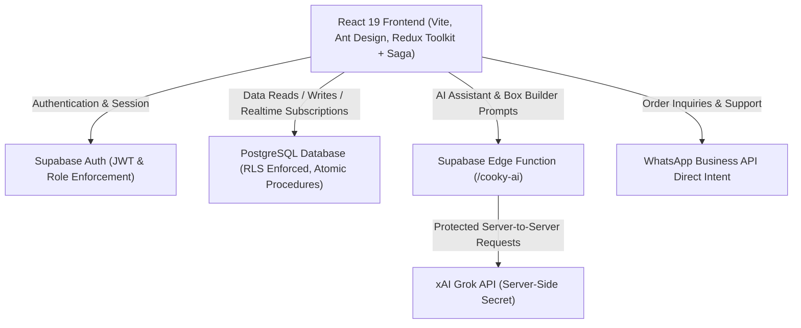

# 🍪 Exynos Cooky — Artisan Cookie E-Commerce & AI Sommelier

A production-grade, full-stack cookie e-commerce platform built with React 19, TypeScript, Vite, Ant Design 6, Redux Toolkit, Redux-Saga, and Supabase. Features an AI-powered Sommelier & Box Builder driven by xAI Grok via secure Supabase Edge Functions, real-time order tracking, strict Row-Level Security (RLS), and a protected Admin operations console.

---

## 🏗️ Architecture Overview



### Key Architectural Principles
1. **Supabase as the Single Source of Truth**: All operational business data (inventory, orders, user profiles, reviews, coupons) lives authoritatively in PostgreSQL.
2. **Strict Row-Level Security (RLS)**: Customers only access their own orders and addresses. Elevated operations (inventory mutations, role queries, order status transitions) require server-verified `admin` role verified via `public.is_admin()`.
3. **Zero Secret Leakage**: The `GROK_API_KEY` and Supabase `service_role` secrets are strictly server-side environment variables inside the Supabase Edge Function. Frontend clients only interact with publishable credentials.
4. **Resilient Offline / Failure Modes**: The client cleanly distinguishes between server errors, validation failures, and network timeouts.

---

## 💻 Tech Stack

| Layer | Technology |
|---|---|
| **Framework** | React 19 (Hooks, Suspense, Concurrent Features) |
| **Language** | TypeScript 5 (Strict type-checking) |
| **Build & Dev Tool** | Vite 8 (Ultra-fast HMR, Rollup code-splitting) |
| **UI Components** | Ant Design 6 (Accessible, modern enterprise UI) |
| **Styling** | Styled Components (Zero CSS conflicts, dynamic theme tokens) |
| **State Management** | Redux Toolkit (Modular feature slices) |
| **Async Side Effects**| Redux-Saga (Declarative effects, cancellation, race protection) |
| **Routing** | React Router DOM v7 (Declarative protected routes, code-split views) |
| **Backend & Auth** | Supabase (PostgreSQL 15, Auth, Row-Level Security, Edge Functions) |
| **AI Intelligence** | xAI Grok (LLM sommelier via Deno Edge Functions) |
| **Realtime** | Supabase Realtime Channels (PostgreSQL CDC for order status changes) |

---

## 📁 Project Structure

```
Exynos-Cooky/
├── src/
│   ├── assets/              # Static branding, imagery, icons
│   ├── components/          # Reusable shared & layout UI
│   │   ├── common/          # Auth modals, CartDrawer, InfoBar, PageTransitionLoader
│   │   ├── customer/        # AIBoxBuilderModal, CookyAIAssistant
│   │   ├── layout/          # AppLayout (Header, Footer), AdminLayout (Sidebar, Shell)
│   │   ├── StyledButton/    # Styled theme-aware primitives
│   │   ├── StyledCard/
│   │   ├── StyledInput/
│   │   └── StyledTitle/
│   ├── constants/           # Pricing, box sizes, UI limits
│   ├── hooks/               # useDebounce, useMediaQuery
│   ├── pages/
│   │   ├── customer/        # Home, BuyCooky, Cart, Checkout, Profile, TrackOrder, AboutUs, Careers
│   │   └── admin/           # Overview (Analytics), Inventory, Orders, UserHistory
│   ├── routes/              # AppRoute.tsx, ProtectedRoute.tsx
│   ├── services/
│   │   ├── ai/              # aiAssistantService (Grok proxy client)
│   │   ├── supabase/        # productService, orderService, profileService, reviewService, couponService
│   │   └── whatsapp/        # Centralized WhatsApp order & support link builders
│   ├── store/
│   │   ├── sagas/           # Root saga, domain sagas (auth, inventory, order, review, etc.)
│   │   ├── slices/          # Domain slices (auth, cart, inventory, orders, reviews, etc.)
│   │   └── index.ts         # Redux store configuration
│   ├── types/               # Domain TypeScript definitions (auth, product, cart, order, review, ai)
│   └── utils/               # Cart helpers, currency formatters, mock fallbacks
├── supabase/
│   ├── functions/cooky-ai/  # Deno Edge Function proxying xAI Grok API
│   ├── migrations/          # PostgreSQL schemas, RLS policies, triggers
│   └── seed.sql             # Initial product catalog and demo data
├── .env.example             # Template for local environment configuration
└── vite.config.ts           # Vite bundler configuration
```

---

## 🔐 Authentication & Roles

Authentication is powered directly by **Supabase Auth**:
- **Customer Sign Up / Login**: Standard email and password authentication with automatic profile creation via PostgreSQL trigger.
- **Admin Authentication**: Verified at the database layer using `is_admin()`. Protected routes check `user.role === 'admin'`. Non-admin users attempting to load `/admin` or invoke admin endpoints are rejected by RLS and client navigation guards.
- **Session Persistence**: Sessions are managed securely via Supabase Auth tokens; passwords and private credentials are never stored in `localStorage`.

---

## 🤖 AI Sommelier & Smart Box Builder

Powered by **xAI Grok** running on Deno Supabase Edge Functions:
1. **Interactive Conversational Sommelier (`CookyAIAssistant`)**:
   - Floating drawer accessible from any customer page.
   - Provides flavor pairings, gift suggestions, ingredient alerts, and baking insights.
   - Supports multi-turn memory and contextual prompt engineering.
2. **AI Box Builder (`AIBoxBuilderModal`)**:
   - Customers specify their mood, craving, party size, or occasion.
   - Grok analyzes the live inventory catalog and returns a structured JSON recommendation (product IDs, recommended slot counts, flavor reasoning).
   - One-click auto-fill populates the user's custom 4-pack, 6-pack, or 12-pack cookie box.
3. **Admin Intelligent Insights**:
   - Generates executive business summaries, sales trend analysis, and stock replenishment recommendations using non-PII aggregated telemetry.

---

## 📦 Database & Migrations

Database tables managed under `supabase/migrations/`:
- `profiles`: Customer profiles, marketing preferences, role assignment (`customer` | `admin`).
- `products`: Cookie catalog, pricing, availability, categories, inventory stock levels.
- `orders`: Order header, customer snapshot, delivery address, discount, subtotal, status (`Pending`, `Baking`, `Dispatched`, `Delivered`, `Cancelled`).
- `order_items`: Line-item snapshots preserving price at moment of purchase.
- `reviews`: Customer reviews with verified purchase flags and star ratings.
- `coupons`: Promotional discount codes with usage limits, minimum order rules, and expiry.
- `addresses`: Multi-address customer shipping address book.

### Applying Migrations Locally
```bash
# Using Supabase CLI
supabase start
supabase db reset
```

---

## 🚀 Getting Started

### Prerequisites
- Node.js 18+ or 20+
- npm 9+ or pnpm

### 1. Clone & Install
```bash
git clone https://github.com/YOUR_USERNAME/Exynos-Cooky.git
cd Exynos-Cooky
npm ci
```

### 2. Configure Environment Variables
Copy `.env.example` to `.env`:
```bash
cp .env.example .env
```

Set your Supabase credentials:
```env
VITE_SUPABASE_URL=https://your-project-ref.supabase.co
VITE_SUPABASE_PUBLISHABLE_KEY=your-publishable-anon-key
# Optional:
# VITE_SUPABASE_AI_FUNCTION_URL=https://your-project-ref.supabase.co/functions/v1/cooky-ai
```

### 3. Deploy the Edge Function & Secrets (Optional for AI)
```bash
# Set your Grok API key in Supabase secrets
supabase secrets set GROK_API_KEY="your-xai-grok-key"

# Deploy the Edge Function
supabase functions deploy cooky-ai
```

### 4. Run Development Server
```bash
npm run dev
```
Navigate to `http://localhost:5173`.

---

## 🧪 Quality Gates & Scripts

| Command | Purpose |
|---|---|
| `npm run dev` | Starts Vite development server with HMR |
| `npx tsc --noEmit -p tsconfig.app.json` | Runs strict TypeScript typecheck |
| `npm run lint` | Executes ESLint across all components and sagas |
| `npm run build` | Compiles production bundle with tree-shaking |
| `npm run preview` | Previews production build locally on port 4173 |

---

## 🌐 Production Deployment

### Vercel Deployment
1. Connect the GitHub repository to [Vercel](https://vercel.com).
2. Configure Environment Variables in Vercel Project Settings:
   - `VITE_SUPABASE_URL`
   - `VITE_SUPABASE_PUBLISHABLE_KEY`
3. Single Page Application routing is pre-configured via `vercel.json`:
```json
{
  "rewrites": [
    { "source": "/(.*)", "destination": "/index.html" }
  ]
}
```
4. Deploy!

---

## 🛡️ Security & Integrity Highlights

- **Client Price Isolation**: Total order calculations and discount validations are strictly verified. Line items capture immutable pricing snapshots.
- **Stock Guarding**: Orders cannot exceed available inventory; out-of-stock items cannot be ordered.
- **Database Authority**: Client mutations route through authenticated RPCs or strict RLS policies.
- **Zero Raw Error Exposure**: End users receive user-friendly localized messages rather than database connection strings or internal stack traces.
- **Accessible UI**: All icon buttons and floating controls provide explicit `aria-label` tags, keyboard event handlers, and semantic landmarks.

---

## 📄 License
This project is licensed under the MIT License.
